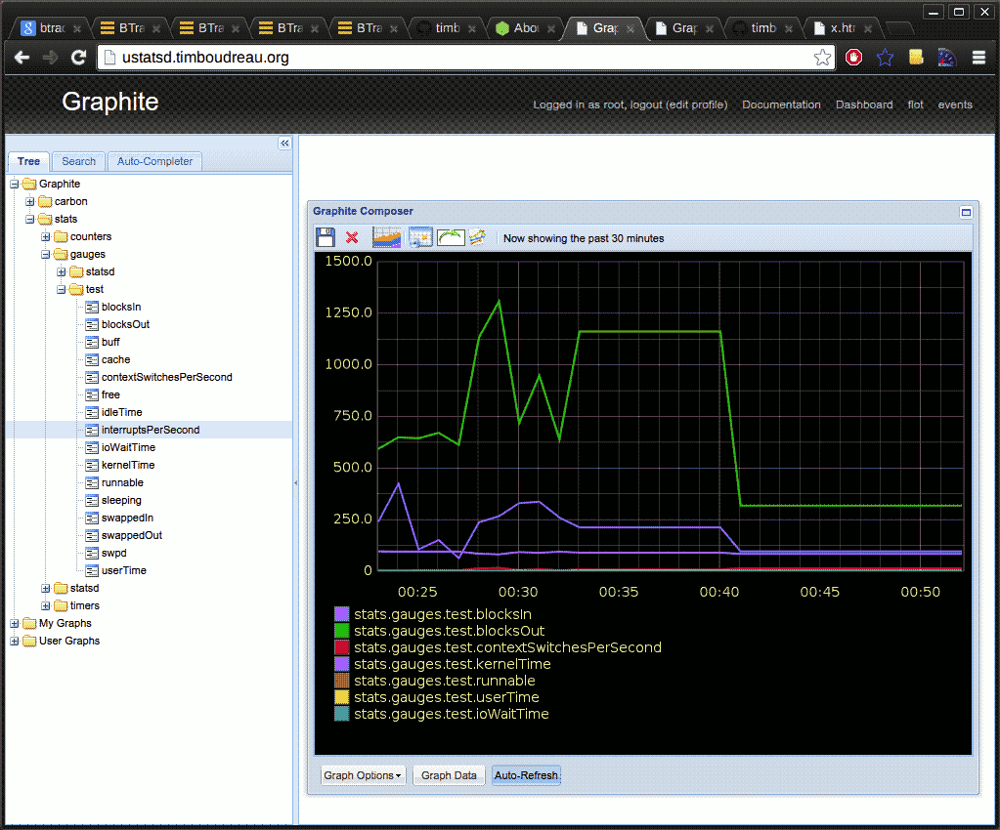

VMStat Statsd Agent
===================

Publishes vmstat info to a statsd instance, to graph system performance data.

Usage
-----

		 ./vmstat-statsd-agent.js

The application will run forever;  simply kill it to stop sending stats.

To install it, simply clone this repository and run `npm install` in the resulting directory.

Caveats
-------

Statsd uses UDP.  That means packets are fire-and-forget.  That's good, but it also means
if the statsd server is down, this application will not notice.

Configuration
-------------
Configuration is done using a JSON file in named vmstat-statsd-agent.json which 
can be located in `/etc`, `/opt/local/etc`, `~/` or `./` (or all of the above, 
merged in that order).  Possible values:

 - **host** - the statsd host
 - **port** - the statsd port - default `8125`
 - **tcp** - true/false - use TCP instead of UDP to send stats to statsd - default `false`
 - **prefix** - prefix to prepend to stats, for use in graphite's ui - default `test`
 - **vmstat** - the path to `vmstat`, default `/usr/bin/vmstat`
 - **log** - log output to the command-line as well, useful for testing

If you use a JSON configuration file, you can also specify which stats are transmitted and what names are used for them.  The defaults map names of
output as shown in vmstats default output to friendly names used in stats using the `mapping` sub-object.  
If you do not want to publish a particular stat, simply remove it from the `mapping` portion of the config.

		{
			  "host": "ustatsd.timboudreau.org",
			  "port": 8125,
			  "tcp": false,
			  "vmstat": "/usr/bin/vmstat",
			  "prefix": "test",
			  "delay": 10,
			  "mapping": {
				    "r": "runnable",
				    "b": "sleeping",
				    "si": "swappedIn",
				    "so": "swappedOut",
				    "bi": "blocksIn",
				    "bo": "blocksOut",
				    "in": "interruptsPerSecond",
				    "cs": "contextSwitchesPerSecond",
				    "us": "userTime",
				    "sy": "kernelTime",
				    "id": "idleTime",
				    "wa": "ioWaitTime",
				    "st": "timeStolen"
			  }
		}

